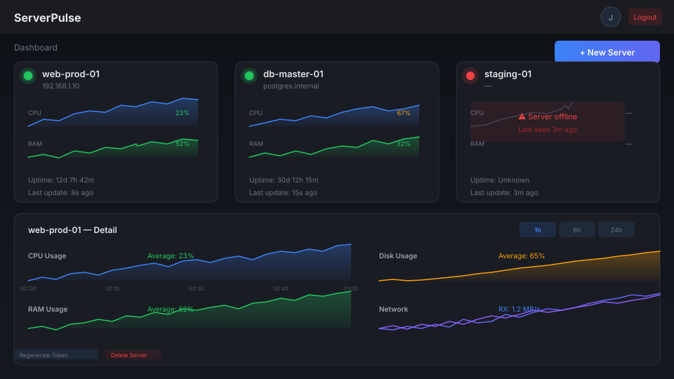

# ServerPulse

[](https://github.com/jorgealonsodev/serverpulse/actions)

**Monitor Linux servers from a single dashboard. Deploy in 3 commands.**

ServerPulse gives you real-time CPU, RAM, disk, network, and load metrics for all your servers. Register an account, add a server with a one-liner, and watch data flow — no config files, no YAML, no SaaS.



---

## Quickstart

```bash
git clone https://github.com/jorgealonsodev/serverpulse.git
cd serverpulse
cp .env.example .env
make up
```

Open [http://localhost](http://localhost). Register, create a server, copy the install command, run it on any Linux box. Done.

---

## What's in the box

| Problem | Solution |
|---------|----------|
| Need to see all server metrics in one place | Dashboard with real-time charts (CPU, RAM, disk, network, load) |
| Don't want complex agent setup | One-liner install: `curl ... \| bash` |
| Need alerts when servers go down | Visual status indicators (online/offline in <3 min) |
| Want to keep it open-source | MIT license, no SaaS dependency, self-hosted |

---

## Stack

| Layer | Technology |
|-------|-----------|
| Backend | Python 3.11+ · FastAPI ≥0.110 · SQLAlchemy 2.0 async |
| Database | PostgreSQL 16 · Redis 7 (pub/sub) |
| Frontend | React 18 · Vite · TypeScript · TailwindCSS 3 · Recharts · Zustand |
| Agent | Python 3.8+ · psutil · requests (zero deps beyond stdlib) |
| Infra | Docker · Docker Compose v2 · Nginx · GitHub Actions |
| Monitoring | Prometheus · Grafana (pre-built dashboard) |

Full stack table: [docs/architecture.md](docs/architecture.md)

---

## How it works

```
Browser ──→ Nginx :80 ──→ Frontend (React/TS)
                       ──→ Backend (FastAPI) :8000 ──→ PostgreSQL
                                                     ──→ Redis (pub/sub)
Agent ──→ POST /metrics/ingest ──→ Backend
```

1. **Backend** serves REST API + WebSocket. Metrics land via agent POST, queries via JWT-authenticated GET.
2. **Frontend** is a React SPA with real-time charts (Recharts) and dark theme (Grafana palette).
3. **Agent** is a single Python script. Runs every 30s, sends to backend, handles SIGTERM cleanly.
4. **Redis** fans out ingested metrics to all connected WebSocket clients.
5. **Nginx** reverse-proxies everything. API → backend, static → frontend, WS → backend with Upgrade headers.

Full architecture: [docs/architecture.md](docs/architecture.md)

---

## Documentation

| Doc | What's in it |
|-----|-------------|
| [docs/architecture.md](docs/architecture.md) | C4 diagram, component explanations, data flow |
| [docs/api.md](docs/api.md) | 13 REST endpoints + WebSocket, request/response examples |
| [docs/deployment.md](docs/deployment.md) | Step-by-step VPS guide (Ubuntu 24.04, TLS, backups) |
| [agent/README.md](agent/README.md) | Agent install, config, troubleshooting, uninstall |

---

## Technical decisions

Why we chose what we chose:

| Decision | Chosen | Why |
|----------|--------|-----|
| Backend framework | **FastAPI** over Flask | Async-native, auto OpenAPI, Pydantic validation |
| Database | **PostgreSQL** over InfluxDB | Relational data first; time-series handled with indexes + 24h retention |
| Real-time | **WebSocket** over SSE | Bidirectional, natural fit with Redis pub/sub fan-out |
| ORM | **SQLAlchemy 2.0 async** over raw asyncpg | Type-safe models, Alembic migrations, familiar API |
| Agent | **Python + psutil** over Go binary | No compilation, runs on any Python 3.8+ system |
| Auth | **JWT (HS256)** over sessions | Stateless, no shared session store needed |
| Frontend state | **Zustand** over Redux | Minimal boilerplate, no providers |
| Password hashing | **bcrypt** (12 rounds) over argon2 | Battle-tested, fast enough for this scale |

---

## Roadmap

**Completed** (all 11 phases):

- [x] Backend: FastAPI, SQLAlchemy async, Alembic, JWT auth
- [x] Servers: CRUD with agent token management, user isolation
- [x] Metrics: ingest (agent-token auth), query (time-range), 24h cleanup
- [x] Real-time: WebSocket with Redis pub/sub, offline detection
- [x] Agent: single Python script, systemd, one-liner installer
- [x] Frontend: React SPA, dark theme, real-time charts, responsive
- [x] Production: Nginx reverse proxy, multi-stage Docker builds
- [x] CI/CD: GitHub Actions (lint, test, build, deploy with rollback)
- [x] Monitoring: Prometheus + Grafana with pre-built dashboard
- [x] Docs: README, architecture, API reference, deployment guide

**Planned:**

- [ ] Email alerts for offline servers
- [ ] Multi-tenant support
- [ ] Custom alert thresholds per server
- [ ] Export metrics as CSV
- [ ] Mobile-responsive dashboard improvements

---

## License

MIT — see [LICENSE](LICENSE).
