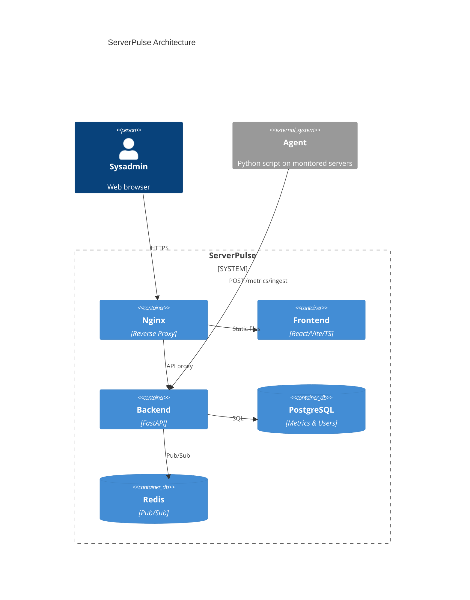

# Architecture

## C4 Context Diagram

## Component Explanations

### Nginx

Nginx acts as the single entry point for all incoming traffic. It serves as a reverse proxy, routing `/api/`, `/health`, and `/metrics` requests to the FastAPI backend on port 8000, while proxying all other paths (`/`) to the frontend container. WebSocket connections at `/api/v1/ws` are handled with proper `Upgrade` and `Connection` headers and a 24-hour read timeout to keep long-lived connections alive. Security headers (`X-Frame-Options`, `X-Content-Type-Options`, `Strict-Transport-Security`) are added to every response.

### Frontend

The frontend is a React 18 application built with Vite and TypeScript. It is compiled to static files during the Docker build step and served by a lightweight Nginx instance inside the frontend container. The dashboard displays real-time charts (Recharts) for CPU, RAM, disk, network, and load average metrics. State management uses Zustand stores, and the WebSocket connection delivers live metric updates and server status changes. The frontend communicates with the backend exclusively through the Nginx proxy.

### Backend

The backend is a FastAPI application (Python 3.11+) that provides the REST API and WebSocket endpoint. It handles user authentication (JWT via python-jose), server CRUD operations, metric ingestion from agents, and metric queries with time-range filtering. On startup, it verifies database and Redis connectivity and spawns a background task that deletes metrics older than 24 hours. Prometheus instrumentation is exposed at `/metrics` via `prometheus-fastapi-instrumentator`. The WebSocket endpoint subscribes to Redis pub/sub channels and forwards real-time messages to connected clients.

### PostgreSQL

PostgreSQL 16 stores all persistent data: users (email, password hash), servers (name, hostname, API token hash, last_seen_at), and metrics (CPU, RAM, disk, network, load average with timestamps). Metrics are retained for 24 hours and cleaned up by a background task. Proper indexes on `server_id` and `recorded_at` enable efficient time-range queries. The database runs on a dedicated Docker volume (`pgdata`) for persistence across container restarts.

### Redis

Redis 7 serves as the pub/sub backbone for real-time metric delivery. When the backend ingests a metric, it publishes the serialized data to a channel named `metrics:{server_id}`. The WebSocket endpoint subscribes to all channels for the authenticated user's servers and forwards incoming messages to the browser. Redis is also used for status change notifications (`status:{server_id}`). The pub/sub model decouples the ingest path from the delivery path, allowing multiple WebSocket clients to receive the same metric without additional database queries.

### Agent

The agent is a lightweight Python script (requires Python 3.8+) that runs on each monitored Linux server. It uses `psutil` to collect CPU, RAM, disk, network, and load average metrics, then sends them to the ServerPulse backend via `POST /api/v1/metrics/ingest` with `X-Agent-Token` authentication. The agent runs in a loop, collecting and sending metrics every 30 seconds. It is installed via a one-liner command generated by the dashboard when a new server is created.

### WebSocket

The WebSocket endpoint (`WS /api/v1/ws?token=<jwt>`) provides real-time metric and status delivery to the frontend. Authentication is done via a JWT passed as a query parameter. On connection, the endpoint loads all servers belonging to the user, subscribes to their Redis pub/sub channels, and sends the current online/offline status for each server. Incoming Redis messages are wrapped with a `type` field (`metric` or `status_change`) and forwarded to the client. On disconnect, all subscriptions are cleaned up and the listener task is cancelled.
